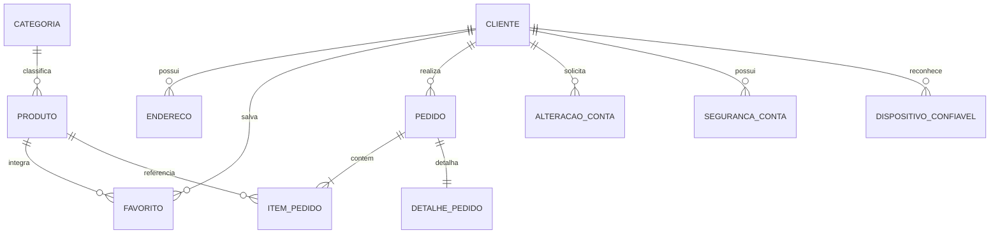

# Banco de Dados

## Visão Geral

A persistência utiliza **SQLite** com **SQLAlchemy**. O modelo foi estruturado a partir das entidades do domínio da aplicação e preserva relacionamentos, integridade referencial e dados necessários aos fluxos de conta e pedido.

## Modelo Conceitual

## Modelo Lógico

| Entidade | Finalidade |
| --- | --- |
| Cliente | cadastro, autenticação e identificação do usuário |
| Categoria | classificação dos produtos |
| Produto | catálogo, preço, disponibilidade e conteúdo comercial |
| Endereco | endereços associados à conta |
| Favorito | relação entre cliente e produto salvo |
| Pedido | cabeçalho e estado da compra registrada |
| ItemPedido | produtos, quantidades e valores preservados no pedido |
| DetalhePedido | informações de recebimento, desconto e contexto do pedido |
| AlteracaoConta | confirmações de alterações sensíveis |
| SegurancaConta | estado de segurança da conta |
| DispositivoConfiavel | dispositivos reconhecidos pelo fluxo de autenticação |

## Regras de Persistência

- chaves primárias identificam os registros persistentes;
- chaves estrangeiras preservam vínculos entre cliente, produto, categoria e pedido;
- valores monetários utilizam precisão decimal;
- o pedido mantém os dados necessários para preservar o contexto da compra;
- o desconto aplicado é registrado junto ao pedido;
- o endereço utilizado é preservado de forma compatível com o histórico;
- exclusões de conta tratam os dados relacionados de acordo com as regras da aplicação.

## Projeto Físico

O banco da aplicação é armazenado em arquivo SQLite persistente no ambiente do PythonAnywhere. O uso de SQLAlchemy centraliza mapeamento, consultas e transações e mantém o mesmo modelo entre desenvolvimento, testes e produção.

## Dicionário de Dados Resumido

| Grupo | Campos Representativos | Regras |
| --- | --- | --- |
| Cliente | nome, CPF, e-mail, celular, senha | CPF e e-mail validados; senha armazenada por hash |
| Produto | nome, descrição, preço, estoque, ativo, categoria | preço decimal; disponibilidade controlada |
| Endereço | CEP, logradouro, número, complemento, bairro, UF, cidade | vinculado ao cliente; um endereço pode ser principal |
| Pedido | cliente, data, situação, total | relacionado a itens e detalhes |
| Item do Pedido | produto, quantidade, preço | preserva valores da compra |
| Detalhe do Pedido | recebimento, pagamento, cupom, desconto, endereço | complementa o pedido confirmado |
| Segurança | tokens, prazos, estado de confirmação e dispositivos | uso restrito aos fluxos de proteção da conta |
