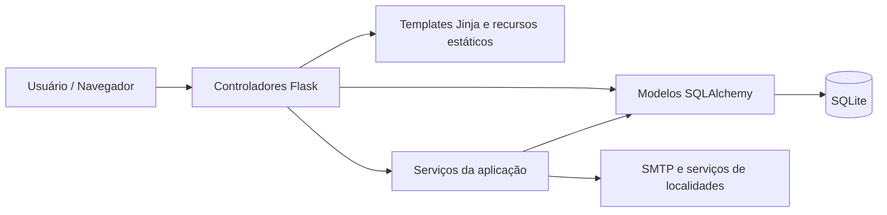

# Modelagem UML

A modelagem formal representa a versão final do sistema e cobre as relações entre cliente, catálogo, conta, carrinho, pedidos e serviços de apoio.

## Diagramas Formais

| Diagrama | Arquivo | Finalidade |
| --- | --- | --- |
| Casos de Uso | `diagramas/01-casos-de-uso.puml` | atores e funcionalidades principais |
| Classes | `diagramas/02-classes.puml` | entidades, associações e multiplicidades |
| Sequência | `diagramas/03-sequencia-finalizacao-pedido.puml` | interação durante a finalização do pedido |
| Atividade | `diagramas/04-atividade-compra.puml` | decisões e repetição do fluxo de compra |
| Componentes | `diagramas/05-componentes-mvc.puml` | separação entre interface, controladores, serviços e dados |

## Visão de Componentes

## Núcleo de Classes

- `Cliente` concentra identificação, autenticação e dados cadastrais;
- `Endereco` representa locais associados ao cliente;
- `Produto` pertence a uma `Categoria` e participa de carrinho, favoritos e pedidos;
- `Favorito` relaciona cliente e produto;
- `Pedido` representa a transação registrada;
- `ItemPedido` preserva produtos e quantidades do pedido;
- `DetalhePedido` mantém informações complementares, incluindo cupom e recebimento;
- `AlteracaoConta`, `SegurancaConta` e `DispositivoConfiavel` apoiam fluxos de confirmação e proteção da conta.

## Fluxo Principal de Compra

1. seleção de produtos e quantidades;
2. composição do carrinho;
3. autenticação do cliente quando necessária;
4. revisão do pedido;
5. definição de entrega ou retirada;
6. seleção do endereço quando aplicável;
7. revalidação de estoque, cupom e dados da conta;
8. persistência do pedido e de seus itens;
9. confirmação visual e registro em Meus Pedidos;
10. envio da mensagem transacional correspondente.

## Coerência da Modelagem

Os diagramas utilizam os mesmos conceitos presentes no código e no banco documentado. A separação em modelos, controladores, serviços, templates e recursos estáticos mantém a arquitetura compatível com o padrão MVC adotado no projeto.
