# Evidências Antes e Depois

## Objetivo

Esta seção reúne as evidências visuais relacionadas aos problemas identificados durante as avaliações externas da solução Doce Pedido e às correções realizadas posteriormente.

Foram utilizados somente estados efetivamente preservados durante o desenvolvimento ou evidências reais inseridas no documento oficial da PIT II. Quando uma captura anterior específica não foi armazenada, a documentação registra essa limitação, sem reconstruir artificialmente o erro.

As imagens do DOCX que não possuíam arquivo idêntico no conjunto já versionado foram extraídas sem edição para `documentacao/01-PLANEJAMENTO-E-MODELAGEM/evidencias/documento-oficial/`. Quando a imagem do Word já era idêntica a uma evidência existente, o arquivo já versionado foi reutilizado.

# Matriz de Evidências do Laudo

| ID | Problema Identificado | Evidência Anterior | Evidência Final |
| --- | --- | --- | --- |
| 01 | Tela offline com excesso de informações e retomada pouco clara | `historico/01-offline-antes.png` | `12-offline.png` |
| 02 | Contraste e visibilidade inadequados no Modo Escuro | `historico/04-faq-antes.png` como ocorrência visual preservada | `13-faq-dark.png` e `16-seguranca.png` |
| 03 | Quebras de layout e baixa responsividade em dispositivos móveis | `historico/05-home-mobile-antes.png` | `02-home-mobile.png` |
| 04 | Poucas informações institucionais, de privacidade e segurança | `historico/06-rodape-antes.png` | `14-sobre-rodape.png` e `16-seguranca.png` |
| 05 | Área do cliente com pouca autonomia | não havia tela equivalente na versão anterior | `documento-oficial/03-id05-minha-conta-depois.jpeg` e `15-favoritos.png` |
| 06 | Ações sensíveis com poucas confirmações adicionais | não havia tela equivalente na versão anterior | `17-validacao-dispositivo-email.jpeg`, `11-validacao-formulario.png` e `16-seguranca.png` |
| 07 | Processo de compra com finalização muito direta | `historico/07-finalizacao-direta-antes.jpeg` | `18-revisar-pedido.jpeg`, `08-checkout.png`, `09-pedido-confirmado.png` e `10-meus-pedidos.png` |
| 08 | FAQ com problemas visuais | `historico/04-faq-antes.png` | `13-faq-dark.png` |
| 09 | Catálogo e produto com elementos grandes e pouca facilidade de filtragem | `documento-oficial/05-id09-catalogo-antes.png` e `documento-oficial/07-id09-produto-antes.png` | `documento-oficial/06-id09-catalogo-depois.png` e `documento-oficial/08-id09-produto-depois.png` |
| 10 | Diferenças de terminologia, títulos e capitalização | `historico/08-padronizacao-textual-antes.png` | `19-padronizacao-textual.png` |

Os caminhos são relativos a `documentacao/01-PLANEJAMENTO-E-MODELAGEM/evidencias/`.

# Comparativos Preservados

## ID 01 - Tela Offline

| Antes | Depois |
| --- | --- |
|  | 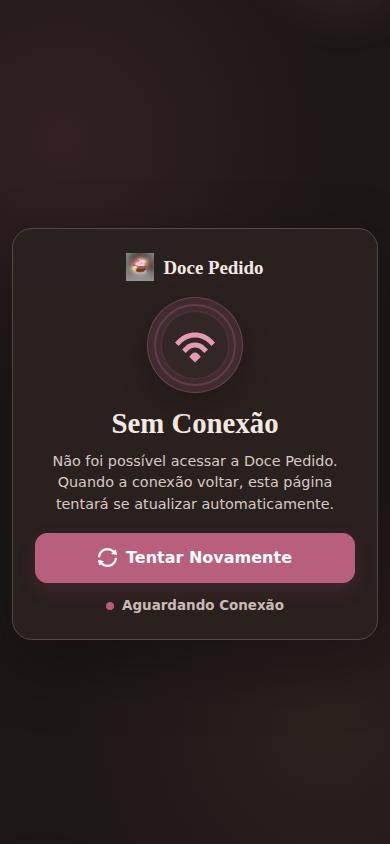 |

**Correção:** simplificação do conteúdo, reorganização visual e ação clara para tentar novamente. **Resultado:** aprovado no reteste.

## ID 02 - Modo Escuro

| Antes | Depois |
| --- | --- |
| 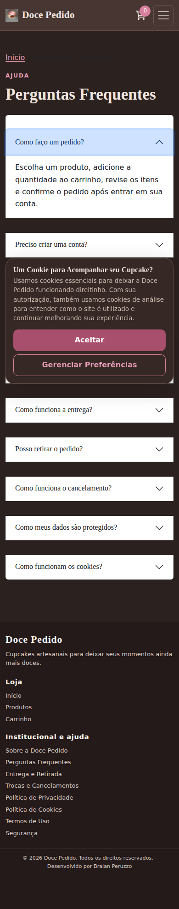 | 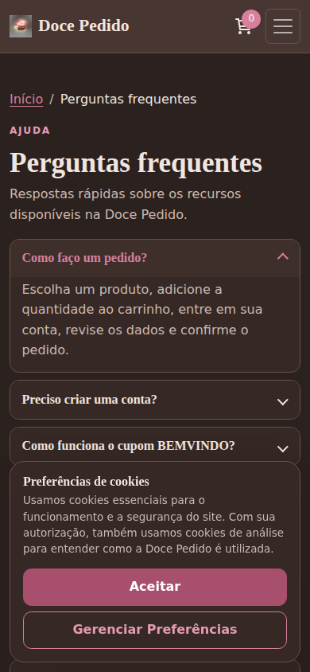 |

A captura histórica da FAQ registra uma ocorrência real de inconsistência visual no tema escuro. A versão final apresenta contraste e componentes revisados.

## ID 03 - Responsividade em Dispositivos Móveis

| Antes | Depois |
| --- | --- |
| 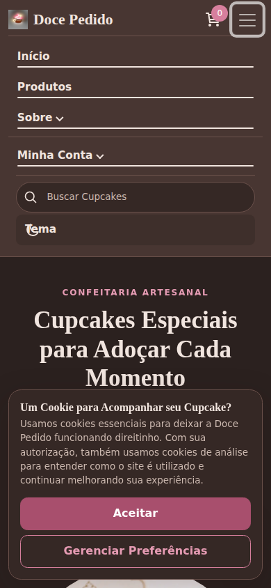 |  |

O mesmo par de imagens está incorporado no documento oficial após a revisão do comparativo de responsividade.

## ID 04 - Conteúdo Institucional, Privacidade e Segurança

| Antes | Depois |
| --- | --- |
| 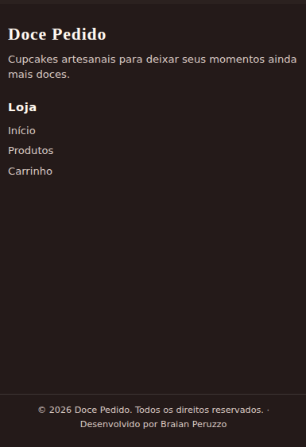 | 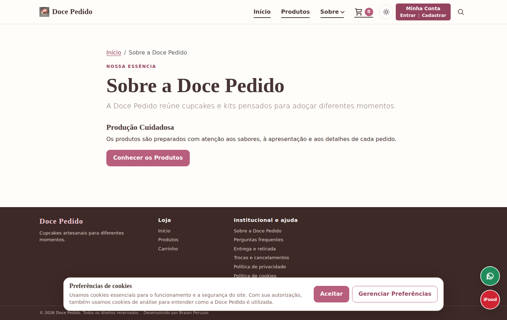 |

A versão final também é complementada por `16-seguranca.png` para demonstrar o conteúdo de segurança.

## ID 05 - Autonomia da Área do Cliente

Não havia tela equivalente na versão anterior para registro comparativo.

A imagem acima foi extraída diretamente do DOCX oficial atualizado. `15-favoritos.png` complementa a comprovação dos recursos incluídos.

## ID 06 - Confirmações em Ações Sensíveis

Não havia tela equivalente na versão anterior para registro comparativo.

A evidência já existente é idêntica à imagem inserida no DOCX oficial; por isso não foi criada uma cópia. `11-validacao-formulario.png` e `16-seguranca.png` complementam a comprovação.

## ID 07 - Revisão e Finalização do Pedido

| Antes | Depois |
| --- | --- |
|  |  |

A evidência anterior mostra o fluxo chegando diretamente à confirmação. A versão corrigida inclui a etapa **Revisar Pedido** antes da confirmação.

## ID 08 - Perguntas Frequentes (FAQ)

| Antes | Depois |
| --- | --- |
|  |  |

## ID 09 - Catálogo e Página de Produto

### Catálogo

| Antes | Depois |
| --- | --- |
| 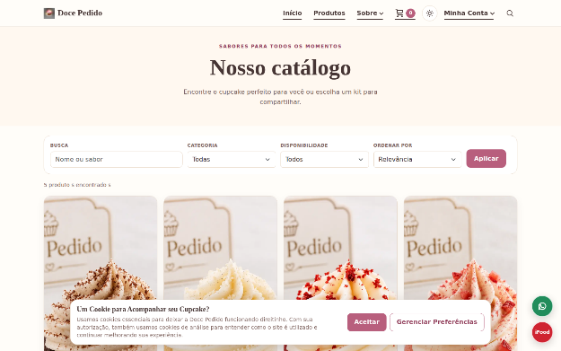 | 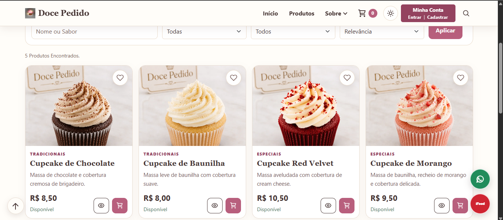 |

### Página de Produto

| Antes | Depois |
| --- | --- |
| 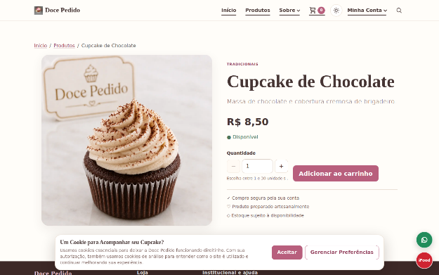 | 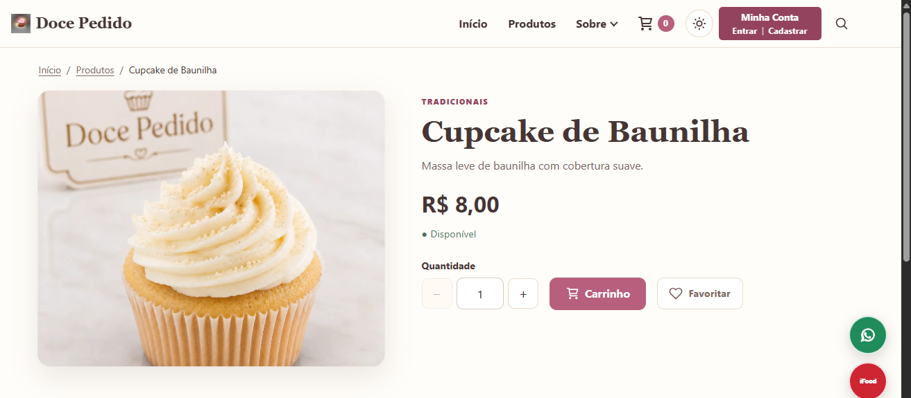 |

Os quatro arquivos foram extraídos diretamente dos dois comparativos atualmente inseridos no documento oficial, mantendo Catálogo e Página de Produto separados.

## ID 10 - Padronização Textual

| Antes | Depois |
| --- | --- |
| 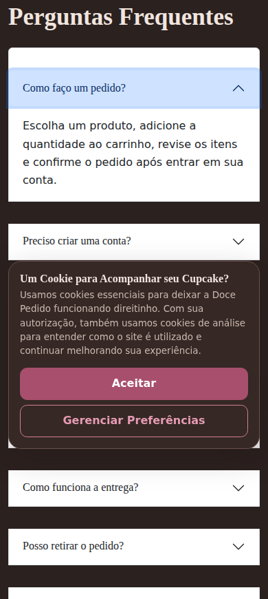 |  |

O comparativo utiliza capturas reais da FAQ. Entre os exemplos visíveis estão:

- **"Perguntas Frequentes" → "Perguntas frequentes"**;
- **"Um Cookie para Acompanhar seu Cupcake?" → "Preferências de cookies"**.

A imagem anterior não foi criada para o laudo: trata-se de recorte de uma captura histórica já preservada. A imagem posterior é um recorte da versão final corrigida.

# Relação com as Avaliações Externas

| Avaliador | IDs | Principais Evidências Relacionadas |
| --- | --- | --- |
| Reberson Faria Gomes | 01, 02 e 03 | Offline, Modo Escuro, Home mobile e responsividade |
| Fernanda de Souza | 04 | Sobre, rodapé, privacidade, cookies e segurança |
| Matheus Moreira | 05, 06 e 07 | Minha Conta, favoritos, validações, revisão do pedido, confirmação e Meus Pedidos |
| Gustavo Coelho | 08 e 09 | FAQ, catálogo e detalhe do produto |
| Gabriela de Lima | 10 | comparativo de padronização textual e conjunto das telas finais revisadas |

# Critério de Integridade das Evidências

Não foram produzidas imagens artificiais para simular bugs ou estados antigos.

Os arquivos da subpasta `documento-oficial/` são extrações diretas das imagens efetivamente incorporadas ao DOCX oficial atualizado. As imagens que já possuíam correspondência binária no conjunto de evidências foram apenas reutilizadas por referência, evitando duplicidade.

Quando não existe uma captura histórica específica, essa condição é informada expressamente.

# Resultado

Os problemas pertinentes foram corrigidos e os fluxos avaliados foram submetidos a novo teste, sem registro de novas falhas relevantes.
