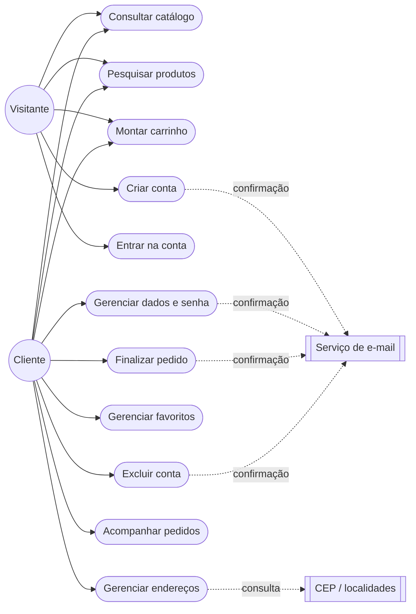
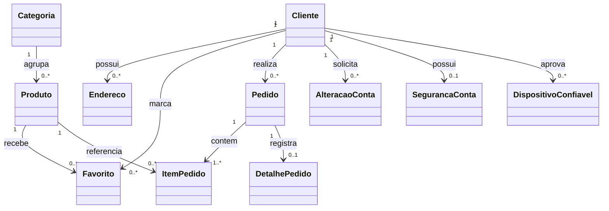
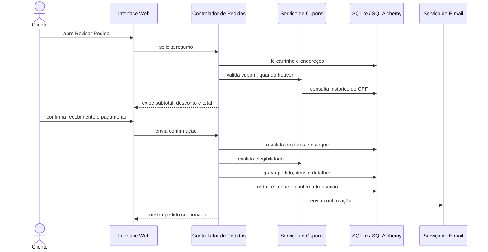
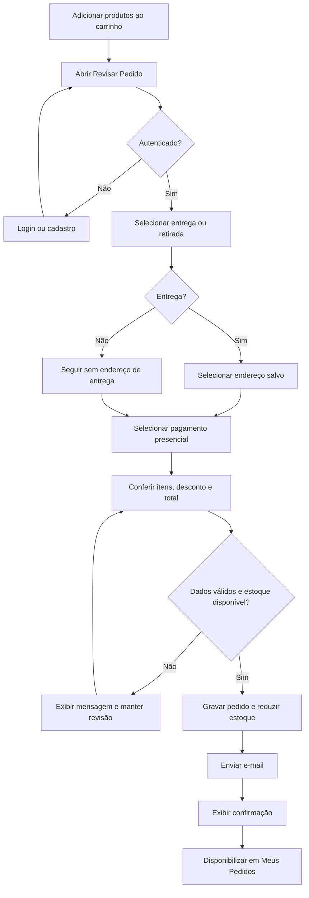
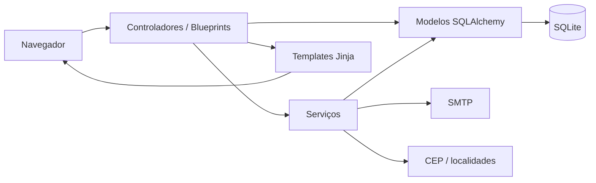
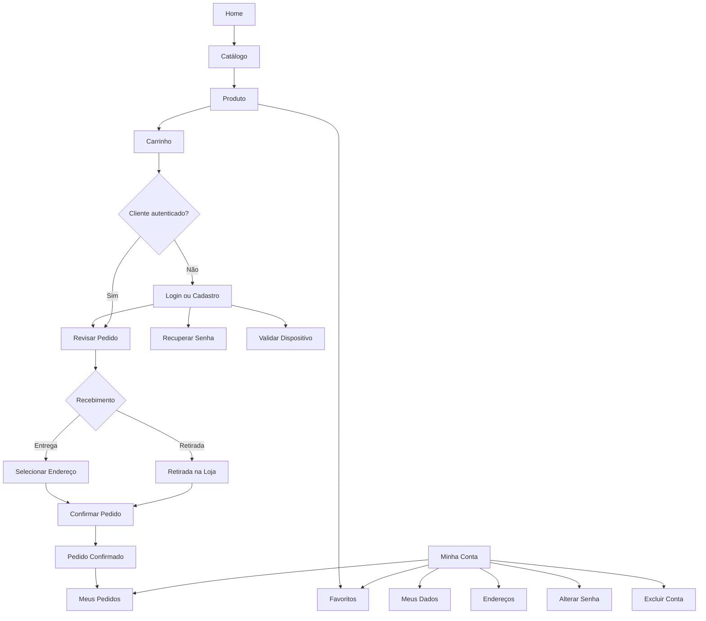
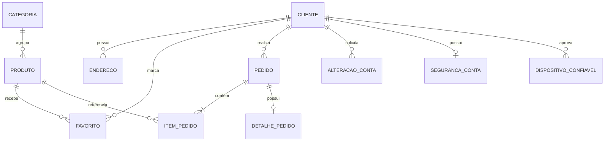

# Documentação Revisada do PIT I - Doce Pedido

**Autor:** Braian Peruzzo  
**RGM:** 34602933  
**Atualização:** Agosto de 2026  
**Repositório:** https://github.com/braianperuzzo/DocePedido  
**Solução publicada:** https://docepedido.pythonanywhere.com/

## Finalidade desta pasta

Esta pasta reúne, em um único local, a revisão da documentação de planejamento originada no Projeto Integrador Transdisciplinar em Engenharia de Software I. A atualização foi realizada para atender à orientação da PIT II de revisitar o projeto anterior, corrigir conceitos, adequar escopo, UML, IHC e banco de dados e manter a documentação atualizada em um repositório Git.

A revisão preserva a ideia central do PIT I, uma solução para venda de cupcakes, mas substitui decisões de planejamento que não correspondem à versão efetivamente implementada. Assim, a documentação passa a representar o **Doce Pedido** como ele existe na entrega final.

## Conteúdo

1. [Escopo e Requisitos](02-ESCOPO-E-REQUISITOS.md)
2. [UML e Arquitetura](03-UML-E-ARQUITETURA.md)
3. [IHC e Experiência do Usuário](04-IHC-E-UX.md)
4. [Banco de Dados](05-BANCO-DE-DADOS.md)
5. [Rastreabilidade e Evolução do PIT I](06-RASTREABILIDADE-E-EVOLUCAO.md)
6. [Documento Consolidado em Markdown](01-DocumentoMelhorado.md)
7. [Documento Original da PIT I em PDF](00-DocumentoOriginal.pdf)
8. [Documento Melhorado da PIT I em PDF](01-DocumentoMelhorado.pdf)

## O que esta revisão atualiza

- escopo e requisitos funcionais conforme a implementação final;
- requisitos não funcionais e regras de negócio;
- atores, casos de uso, classes, sequência, atividades e arquitetura;
- IHC, UX, responsividade, tema claro/escuro e comportamento offline;
- projeto conceitual, lógico e físico do banco de dados;
- dicionário de dados das entidades persistidas;
- diferenças entre o planejamento inicial e a solução final;
- rastreabilidade entre requisitos, implementação e verificação.

## Observação histórica

Os protótipos originais da PIT I não estão disponíveis no repositório atual. Por isso, esta revisão não inventa telas históricas. A documentação de IHC usa a solução final e as evidências reais já registradas no projeto.

---

# 1 - Escopo e Requisitos Revisados

## 1.1 Objetivo revisado

O Doce Pedido é uma aplicação web acadêmica para uma loja demonstrativa de cupcakes. O sistema permite que visitantes consultem produtos e montem um carrinho e que clientes identificados possam gerenciar sua conta, concluir pedidos e consultar o histórico de compras.

A ideia central do PIT I foi mantida, mas o escopo foi atualizado para refletir a aplicação realmente construída. Funcionalidades previstas inicialmente, como gateway de pagamento on-line, integração com transportadora e painel administrativo, não são apresentadas como prontas quando não fazem parte da versão final.

## 1.2 Atores

- **Visitante:** consulta a loja, pesquisa produtos, monta o carrinho e pode criar uma conta.
- **Cliente:** gerencia conta, endereços e favoritos, finaliza pedidos e consulta o histórico.
- **Serviço de e-mail:** envia confirmações de cadastro, senha, alterações da conta, validação de dispositivo e pedidos.
- **Serviços públicos de localização:** apoiam consulta de CEP, estados e municípios.

## 1.3 Requisitos funcionais consolidados

| ID | Requisito | Situação |
| --- | --- | --- |
| RF01 | Exibir página inicial com produtos ativos em destaque | Implementado |
| RF02 | Listar, pesquisar e abrir detalhes de produtos ativos | Implementado |
| RF03 | Adicionar, atualizar, remover e esvaziar itens do carrinho | Implementado |
| RF04 | Criar conta com nome, CPF, e-mail e senha | Implementado |
| RF05 | Confirmar o cadastro por e-mail | Implementado |
| RF06 | Autenticar e encerrar a sessão do cliente | Implementado |
| RF07 | Recuperar e redefinir senha por e-mail | Implementado |
| RF08 | Editar nome, e-mail e celular com confirmação por e-mail | Implementado |
| RF09 | Manter o CPF sem possibilidade de alteração após o cadastro | Implementado |
| RF10 | Alterar senha com confirmação por e-mail | Implementado |
| RF11 | Excluir a conta somente após confirmação por e-mail | Implementado |
| RF12 | Cadastrar, editar, excluir e definir endereço principal | Implementado |
| RF13 | Consultar CEP e selecionar UF e município no cadastro de endereço | Implementado |
| RF14 | Marcar e remover produtos favoritos | Implementado |
| RF15 | Aplicar o cupom BEMVINDO com 10% de desconto na primeira compra do CPF | Implementado |
| RF16 | Revisar o pedido antes da confirmação | Implementado |
| RF17 | Escolher entrega em endereço salvo ou Retirada na Loja | Implementado |
| RF18 | Escolher outro endereço salvo diretamente na revisão | Implementado |
| RF19 | Trabalhar com frete grátis no fluxo atual | Implementado |
| RF20 | Aceitar somente Pagamento Presencial na entrega ou retirada | Implementado |
| RF21 | Exibir Pix e cartão on-line como opções indisponíveis | Implementado |
| RF22 | Registrar pedido, itens, total, desconto, recebimento, pagamento e endereço usado | Implementado |
| RF23 | Reduzir o estoque no fechamento do pedido | Implementado |
| RF24 | Enviar e-mail de confirmação do pedido | Implementado, depende de SMTP |
| RF25 | Listar pedidos do cliente e abrir seus detalhes | Implementado |
| RF26 | Permitir acesso ao produto a partir de um item do histórico, quando ativo | Implementado |

## 1.4 Requisitos não funcionais

| ID | Categoria | Especificação |
| --- | --- | --- |
| RNF01 | Usabilidade | Interface responsiva, linguagem direta, navegação consistente, feedback de ações e validação próxima ao contexto do usuário. |
| RNF02 | Segurança | Senhas armazenadas por hash, CSRF, rate limiting, confirmação por e-mail em ações sensíveis, validação opcional de dispositivo e páginas privadas sem cache. |
| RNF03 | Compatibilidade | Aplicação web responsiva para desktop, tablet e celular, com PWA e página offline. |
| RNF04 | Acessibilidade | Foco visível, navegação por teclado, atributos ARIA e respeito a redução de movimento quando aplicável. |
| RNF05 | Integridade | Validação de estoque, quantidades, propriedade dos dados, cupom e endereço antes de confirmar alterações ou pedidos. |
| RNF06 | Manutenibilidade | Separação entre modelos, controladores, serviços, templates e recursos estáticos, seguindo organização compatível com MVC. |
| RNF07 | Privacidade | Consentimento separado para análise de uso, páginas de privacidade, cookies, termos e segurança. |
| RNF08 | Testabilidade | Suíte automatizada com Pytest e verificações técnicas complementares registradas no repositório. |

## 1.5 Regras de negócio

- Produtos inativos não podem ser adicionados ao carrinho nem favoritados.
- Quantidades devem ser inteiras, positivas e não podem ultrapassar o estoque disponível.
- O CPF é obrigatório para novos cadastros, único e não pode ser alterado na área do cliente.
- O cupom BEMVINDO concede 10% de desconto somente quando não existe pedido anterior associado ao CPF.
- O cupom é validado novamente antes da confirmação do pedido.
- O pedido registra o código do cupom e o valor do desconto para preservar o histórico.
- O checkout revalida carrinho, produtos e estoque antes de criar o pedido.
- Um cliente só pode consultar os próprios pedidos e endereços.
- O endereço escolhido é copiado para o pedido, preservando o dado utilizado na compra.
- O pagamento on-line não é processado. Pix e cartão aparecem apenas como opções futuras desabilitadas.
- A exclusão da conta só ocorre depois da confirmação do link enviado por e-mail.

## 1.6 Fora do escopo atual

- pagamento on-line por Pix ou cartão;
- cálculo dinâmico de frete;
- painel administrativo para cadastro de produtos, estoque ou gestão de pedidos;
- integração com transportadora;
- integração funcional com WhatsApp ou iFood;
- notificações push;
- processamento de dados de cartão.

Essas limitações são intencionais e não devem ser descritas como funcionalidades prontas na apresentação acadêmica.

---

# 2 - UML e Arquitetura Revisadas

## 2.1 Perspectivas da modelagem

A modelagem foi atualizada para representar a solução final em quatro perspectivas:

1. funcional, por atores e casos de uso;
2. estrutural, por classes e relacionamentos persistidos;
3. comportamental, pelos fluxos de autenticação e compra;
4. arquitetural, pela separação de modelos, controladores, serviços, templates e recursos estáticos.

## 2.2 Casos de uso principais

## 2.3 Classes do domínio

| Classe | Responsabilidade |
| --- | --- |
| Cliente | Conta, autenticação e vínculo com pedidos e dados pessoais |
| Categoria | Organização do catálogo |
| Produto | Item comercializado, preço, estoque e imagem |
| Endereco | Endereço salvo do cliente |
| Favorito | Associação entre cliente e produto favorito |
| Pedido | Compra confirmada e valor final |
| ItemPedido | Produto, quantidade e valores históricos do pedido |
| DetalhePedido | Recebimento, pagamento, frete, cupom, desconto e endereço usado |
| AlteracaoConta | Solicitação temporária de alteração ou exclusão |
| SegurancaConta | Referência de troca periódica de senha |
| DispositivoConfiavel | Navegador aprovado para a conta |

## 2.4 Sequência da finalização do pedido

## 2.5 Atividade principal de compra

## 2.6 Arquitetura

| Camada | Local no projeto | Responsabilidade |
| --- | --- | --- |
| Model | `aplicacao/modelos/` | entidades e relacionamentos persistidos |
| Controller | `aplicacao/controladores/` | rotas, validações HTTP e coordenação dos fluxos |
| View | `aplicacao/templates/` | páginas Jinja apresentadas ao usuário |
| Service | `aplicacao/servicos/` | e-mail, tokens, cupom e operações compartilhadas |
| Static | `aplicacao/static/` | CSS, JavaScript, imagens, manifesto e Service Worker |

---

# 3 - IHC e Experiência do Usuário Revisadas

## 3.1 Objetivo da revisão

A interface foi revisada para tornar as ações principais visíveis, reduzir informação desnecessária, manter feedback consistente e funcionar de forma previsível em desktop e dispositivos móveis. Foram aplicados os princípios apresentados no material da PIT II: clareza, consistência, simplicidade, controle pelo usuário, relação direta entre ação e resultado, possibilidade de recuperação, feedback e organização visual.

## 3.2 Telas atuais

| Tela/área | Finalidade |
| --- | --- |
| Home | Apresentação da loja, destaques, benefícios e acesso ao catálogo. |
| Catálogo | Busca, filtros, ordenação e navegação entre produtos ativos. |
| Produto | Detalhes, preço, disponibilidade, quantidade, carrinho e favorito. |
| Carrinho | Itens, quantidades, subtotais, cupom e total. |
| Login e Cadastro | Autenticação, criação de conta e recuperação de senha. |
| Minha Conta | Dados pessoais, alteração de senha, segurança e exclusão da conta. |
| Endereços | Cadastro, edição, exclusão e definição de endereço principal. |
| Favoritos | Produtos marcados pelo cliente. |
| Revisar Pedido | Recebimento, endereço, pagamento e resumo final. |
| Meus Pedidos | Histórico, situação e itens de cada pedido. |
| Institucional | Sobre, entrega, privacidade, cookies, termos, segurança e ajuda. |
| Offline | Feedback quando a aplicação não consegue acessar o servidor. |

## 3.3 Critérios aplicados

### Consistência

- cabeçalho e rodapé compartilhados;
- botões e mensagens com padrão comum;
- cards de produto reutilizados;
- formulários com labels visíveis ou flutuantes;
- títulos, termos e capitalização revisados.

### Feedback e prevenção de erros

- validação de formulários, estoque e quantidades;
- opções de pagamento on-line visíveis, mas desabilitadas;
- seleção de UF antes do município;
- preservação do carrinho durante autenticação;
- etapa de revisão antes da confirmação do pedido;
- mensagens integradas ao próprio site.

### Recuperação

- falhas de validação mantêm o usuário no contexto adequado;
- a página offline permite nova tentativa;
- uma falha de SMTP depois da persistência não apaga o pedido já registrado.

## 3.4 Mensagens, Feedback e Tratamento de Erros

A interface utiliza mensagens integradas ao próprio site para orientar o usuário durante ações, validações e situações de erro. O objetivo é informar o que ocorreu, preservar o contexto da operação e indicar uma ação de recuperação quando aplicável.

| Situação | Feedback apresentado | Recuperação esperada |
| --- | --- | --- |
| Campo obrigatório ou inválido | mensagem associada ao formulário | corrigir o dado e reenviar |
| Credenciais inválidas | mensagem de autenticação sem exposição de detalhes internos | revisar e-mail e senha ou recuperar a senha |
| Quantidade superior ao estoque | aviso de indisponibilidade ou limite | ajustar a quantidade |
| Cupom não elegível | informação de que o benefício não pode ser aplicado | continuar sem o desconto ou revisar os critérios |
| Ausência de endereço para entrega | orientação para cadastrar ou selecionar endereço | acessar o gerenciamento de endereços |
| Ação sensível na conta | confirmação adicional e, quando previsto, validação por e-mail | concluir ou cancelar a operação |
| Novo dispositivo | solicitação de validação do dispositivo | confirmar pelo fluxo de segurança |
| Falha de conexão | página offline com ação de nova tentativa | restabelecer a conexão e tentar novamente |
| Falha de transporte de e-mail após pedido | o pedido permanece registrado | consultar o pedido em Meus Pedidos |

As mensagens foram revisadas para manter terminologia, capitalização e apresentação consistentes entre as páginas.

## 3.5 Melhorias incorporadas após a revisão

| Situação identificada | Atualização realizada |
| --- | --- |
| Tela offline densa | Simplificação e ação clara de nova tentativa |
| Baixa visibilidade no Modo Escuro | Revisão de contraste e superfícies |
| Excesso visual e quebras em mobile | Reorganização de menu, grids, formulários e tamanhos |
| Pouco conteúdo institucional | Ampliação de Sobre, rodapé, privacidade, cookies e segurança |
| Pouca autonomia na conta | Edição de dados, endereços, favoritos e exclusão da conta |
| Compra direta demais | Revisar Pedido com endereço, recebimento, pagamento e resumo |
| FAQ e cards desproporcionais | FAQ reestruturada, filtros e compactação de componentes |
| Textos inconsistentes | Revisão textual e padronização de termos e títulos |

## 3.6 Mapa Conceitual da Navegação

## 3.7 Responsividade, tema e PWA

A interface utiliza Bootstrap e CSS próprio, reorganizando menu, grids, formulários, cards e botões conforme o espaço disponível. A solução oferece tema claro e escuro, foco visível, navegação por teclado, atributos ARIA, PWA com manifesto e Service Worker e uma página dedicada ao modo offline.

## 3.8 Evolução do Protótipo e da Interface

Os arquivos-fonte dos protótipos originalmente produzidos na PIT I não estão disponíveis no repositório atual. Por esse motivo, eles não foram recriados artificialmente.

A revisão e o incremento da interface são demonstrados por meio da evolução real da aplicação implementada. Foram preservados estados anteriores de cinco áreas da solução, permitindo comparar a situação observada durante o desenvolvimento com a versão final corrigida.

| Área | Situação anterior | Evolução realizada |
| --- | --- | --- |
| Home Mobile | adaptação limitada em telas menores | reorganização dos controles, conteúdo e responsividade |
| Catálogo | cards grandes e ausência dos filtros atuais | filtros, ordenação e compactação dos cards |
| Produto | excesso visual e dimensões maiores | reorganização da imagem, informações e ações |
| FAQ | problemas de layout e contraste | revisão para desktop, mobile e Modo Escuro |
| Offline | excesso de informações e retomada pouco clara | simplificação e ação clara de nova tentativa |

Os comparativos reais estão documentados em:

[`EVIDENCIAS_ANTES_DEPOIS.md`](../03-TESTES-E-QUALIDADE/EVIDENCIAS_ANTES_DEPOIS.md)

Dessa forma, o incremento do protótipo é representado pela evolução efetivamente realizada na interface, utilizando somente evidências preservadas durante o desenvolvimento.

---

# 4 - Projeto de Banco de Dados Revisado

## 4.1 Tecnologia adotada

A versão final utiliza **SQLite** como SGBD e **SQLAlchemy/Flask-SQLAlchemy** como camada de mapeamento objeto-relacional. O planejamento anterior usava MySQL como referência de projeto físico; a revisão substitui essa decisão pelo banco efetivamente utilizado.

O banco local padrão é criado em `instance/doce_pedido.db` e não é versionado. O esquema inicial é criado com `banco.create_all()`. O projeto não utiliza uma ferramenta geral de migrations; existe uma rotina aditiva de compatibilidade para bases SQLite locais antigas.

## 4.2 Projeto conceitual

Entidades persistentes:

- Cliente
- Categoria
- Produto
- Endereço
- Favorito
- Pedido
- Item do Pedido
- Detalhe do Pedido
- Alteração da Conta
- Segurança da Conta
- Dispositivo Confiável

O cupom `BEMVINDO` é uma regra de negócio, não uma entidade. Seu código e o valor do desconto são preservados em `detalhe_pedido` quando utilizados.

## 4.3 Projeto lógico

O relacionamento muitos-para-muitos entre cliente e produto, usado em favoritos, é resolvido pela tabela `favorito`. O relacionamento entre pedido e produto é resolvido por `item_pedido`, que também registra quantidade, valor unitário e subtotal.

Os valores do pedido são preservados historicamente. Alterações posteriores de preço ou endereço não modificam pedidos já confirmados, porque `item_pedido.valor_unitario`, `item_pedido.subtotal` e `detalhe_pedido.endereco_entrega` guardam os dados utilizados naquele fechamento.

## 4.4 Projeto físico

- **SGBD:** SQLite
- **ORM:** SQLAlchemy / Flask-SQLAlchemy
- **Chaves primárias:** inteiros, salvo a chave compartilhada de `seguranca_conta`
- **Chaves estrangeiras:** utilizadas entre entidades relacionadas
- **Valores monetários:** `Numeric(10, 2)`
- **Datas:** `DateTime`
- **Textos longos:** `Text`
- **Criação inicial:** `banco.create_all()`

## 4.5 Dicionário de dados

### `cliente`

| Campo | Tipo | Nulo | Regra / finalidade |
| --- | --- | --- | --- |
| id | Integer | Não | Chave primária |
| nome | String(120) | Não | Nome do cliente |
| email | String(255) | Não | Único e indexado |
| cpf | String(11) | Compat. | Único; obrigatório em novos cadastros e imutável |
| senha_hash | String(255) | Não | Hash da senha |
| telefone | String(20) | Sim | Celular normalizado |
| ativo | Boolean | Não | Permite autenticação |
| data_cadastro | DateTime | Não | Data de criação |

### `categoria`

| Campo | Tipo | Nulo | Regra / finalidade |
| --- | --- | --- | --- |
| id | Integer | Não | Chave primária |
| nome | String(80) | Não | Único |
| descricao | Text | Sim | Descrição |
| ativo | Boolean | Não | Estado da categoria |

### `produto`

| Campo | Tipo | Nulo | Regra / finalidade |
| --- | --- | --- | --- |
| id | Integer | Não | Chave primária |
| categoria_id | Integer | Não | FK categoria |
| nome | String(120) | Não | Nome exibido |
| descricao | Text | Sim | Descrição |
| preco | Numeric(10,2) | Não | Preço unitário |
| estoque | Integer | Não | Quantidade disponível |
| ativo | Boolean | Não | Disponibilidade |
| imagem | String(255) | Sim | Caminho da imagem |

### `endereco`

| Campo | Tipo | Nulo | Regra / finalidade |
| --- | --- | --- | --- |
| id | Integer | Não | Chave primária |
| cliente_id | Integer | Não | FK cliente |
| nome | String(60) | Não | Identificador do endereço |
| cep | String(8) | Não | CEP |
| logradouro | String(160) | Não | Logradouro |
| numero | String(20) | Não | Número |
| complemento | String(100) | Sim | Complemento |
| bairro | String(100) | Não | Bairro |
| cidade | String(100) | Não | Município |
| uf | String(2) | Não | UF |
| referencia | String(180) | Sim | Ponto de referência |
| principal | Boolean | Não | Endereço preferencial |
| criado_em | DateTime | Não | Data de criação |

### `favorito`

| Campo | Tipo | Nulo | Regra / finalidade |
| --- | --- | --- | --- |
| id | Integer | Não | Chave primária |
| cliente_id | Integer | Não | FK cliente |
| produto_id | Integer | Não | FK produto |
| criado_em | DateTime | Não | Data de marcação |

### `pedido`

| Campo | Tipo | Nulo | Regra / finalidade |
| --- | --- | --- | --- |
| id | Integer | Não | Chave primária e número do pedido |
| cliente_id | Integer | Não | FK cliente |
| data_pedido | DateTime | Não | Data de confirmação |
| status | String(30) | Não | Situação do pedido |
| valor_total | Numeric(10,2) | Não | Total final |

### `item_pedido`

| Campo | Tipo | Nulo | Regra / finalidade |
| --- | --- | --- | --- |
| id | Integer | Não | Chave primária |
| pedido_id | Integer | Não | FK pedido |
| produto_id | Integer | Não | FK produto |
| quantidade | Integer | Não | Quantidade comprada |
| valor_unitario | Numeric(10,2) | Não | Preço histórico |
| subtotal | Numeric(10,2) | Não | Quantidade x valor |

### `detalhe_pedido`

| Campo | Tipo | Nulo | Regra / finalidade |
| --- | --- | --- | --- |
| id | Integer | Não | Chave primária |
| pedido_id | Integer | Não | FK única para pedido |
| tipo_entrega | String(30) | Não | Entrega ou Retirada na Loja |
| forma_pagamento | String(30) | Não | Presencial |
| valor_frete | Numeric(10,2) | Não | Zero no fluxo atual |
| cupom_codigo | String(30) | Sim | Cupom aplicado |
| valor_desconto | Numeric(10,2) | Não | Valor descontado |
| endereco_entrega | Text | Sim | Cópia do endereço usado |

### `alteracao_conta`

| Campo | Tipo | Nulo | Regra / finalidade |
| --- | --- | --- | --- |
| id | Integer | Não | Chave primária |
| cliente_id | Integer | Não | FK cliente |
| tipo | String(20) | Não | dados, senha ou exclusao |
| token_hash | String(64) | Não | Hash do token |
| senha_fingerprint | String(64) | Não | Vínculo com estado da senha |
| dados_json | Text | Sim | Dados pendentes |
| senha_hash_nova | String(255) | Sim | Nova senha pendente |
| criado_em | DateTime | Não | Criação |
| expira_em | DateTime | Não | Validade |
| concluida_em | DateTime | Sim | Confirmação |

### `seguranca_conta`

| Campo | Tipo | Nulo | Regra / finalidade |
| --- | --- | --- | --- |
| cliente_id | Integer | Não | PK e FK cliente |
| senha_alterada_em | DateTime | Não | Referência para troca periódica |
| senha_fingerprint | String(64) | Sim | Identifica alteração do hash |

### `dispositivo_confiavel`

| Campo | Tipo | Nulo | Regra / finalidade |
| --- | --- | --- | --- |
| id | Integer | Não | Chave primária |
| cliente_id | Integer | Não | FK cliente |
| token_hash | String(64) | Não | Hash único do navegador |
| user_agent | String(255) | Sim | Informação auxiliar |
| criado_em | DateTime | Não | Data de aprovação |
| expira_em | DateTime | Não | Validade |

## 4.6 Integridade complementar

Além das restrições do banco, os controladores e serviços validam CPF, e-mail, celular, CEP, UF, propriedade de endereços e pedidos, estoque, quantidades, cupom e regras de segurança antes de persistir alterações.

O SQLite é adequado ao escopo acadêmico e ao ambiente atual. Uma publicação de maior escala deveria definir política de backup, persistência, concorrência e evolução de esquema antes de mudanças estruturais.

---

# 5 - Rastreabilidade e Evolução do PIT I

## 5.1 Principais mudanças entre o planejamento e a versão final

| Aspecto | Planejamento anterior | Documentação revisada / solução final |
| --- | --- | --- |
| Objetivo central | Venda de cupcakes com catálogo, carrinho, pagamento e acompanhamento. | Mantido: aplicação web de e-commerce para cupcakes com catálogo, carrinho, conta e pedidos. |
| Plataforma | Planejamento inicialmente orientado a aplicativo/protótipo móvel. | Aplicação Web responsiva e PWA, acessível por navegador e instalável. |
| Back-end | Ainda não definido na documentação inicial. | Python com Flask. |
| Banco de dados | Modelo físico de referência preparado para MySQL. | SQLite com SQLAlchemy, adequado ao escopo acadêmico e à hospedagem atual. |
| Pagamento | Previsão de gateway e aprovação de pagamento on-line. | Pagamento Presencial é a única opção ativa; Pix e cartão ficam visíveis e desabilitados. |
| Entrega | Previsão de serviço de entrega e acompanhamento mais amplo. | Entrega em endereço salvo ou Retirada na Loja, com frete grátis no fluxo atual. |
| Administração | Planejamento previa administração básica de produtos, estoque e status. | Painel administrativo não integra o escopo final publicado. |
| Conta do cliente | Cadastro, autenticação e atualização básica. | CPF, confirmação por e-mail, recuperação de senha, edição de dados, endereços, favoritos, exclusão e segurança adicional. |
| UX | Protótipos do fluxo mínimo de compra. | Interface revisada para desktop/mobile, Modo Escuro, acessibilidade, feedback, FAQ, filtros e padronização textual. |
| Recursos adicionais | Não detalhados no PIT I. | Cupom de primeira compra, PWA, offline, cookies, privacidade, segurança e e-mails transacionais. |

## 5.2 Rastreabilidade funcional

| Funcionalidade | Implementação principal | Verificação |
| --- | --- | --- |
| Home e navegação | Página inicial, templates e recursos estáticos | Interface e responsividade |
| Catálogo e busca | Controlador e templates de produtos | Produtos, busca e interface |
| Carrinho | Controlador do carrinho | Carrinho, estoque e quantidades |
| Cupom BEMVINDO | Serviço de cupons, carrinho e pedidos | Cupons e pedidos |
| Cadastro e login | Autenticação e modelos de segurança | Autenticação, confirmação e sessão |
| Minha Conta | Conta, endereços, favoritos e alterações | Conta e recursos do cliente |
| Checkout | Pedidos, Pedido, ItemPedido e DetalhePedido | Pedidos e interface |
| Confirmação e histórico | Pedidos e e-mail | Pedidos, e-mail e Meus Pedidos |
| PWA e offline | Manifesto, Service Worker e página offline | PWA, mobile e fallback |
| Segurança | Autenticação, tokens e dispositivo confiável | Segurança e fluxos sensíveis |

## 5.3 Relação com a atividade da PIT II

A atividade solicita revisitar a documentação desenvolvida na PIT I, realizar atualizações e melhorias conforme o material teórico e manter o resultado em um repositório Git. Esta pasta atende diretamente a essa solicitação porque consolida:

- escopo e requisitos revisados;
- UML coerente com o sistema final;
- IHC e UX atualizadas;
- projeto conceitual, lógico e físico do banco;
- dicionário de dados;
- rastreabilidade entre planejamento e implementação.

## 5.4 Referências do projeto

- Repositório: https://github.com/braianperuzzo/DocePedido
- Aplicação publicada: https://docepedido.pythonanywhere.com/
- Material da disciplina: Projeto Integrador Transdisciplinar em Engenharia de Software II, Cruzeiro do Sul Virtual, 2026.
- Documento de intervenção da PIT II: revisão do aplicativo de venda de cupcakes definido no PIT I, 2026.

## 5.5 Conclusão

A revisão manteve a finalidade do projeto original, mas atualizou decisões de escopo, plataforma, banco de dados, pagamento, segurança e interface para refletir o Doce Pedido efetivamente entregue. O resultado é uma documentação consistente com a implementação, verificável pelo código e adequada para ser mantida no GitHub junto da solução.
