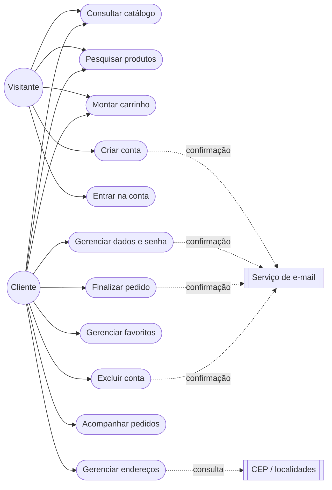
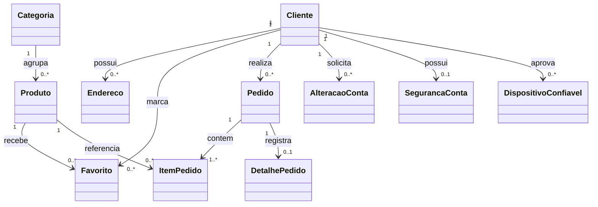
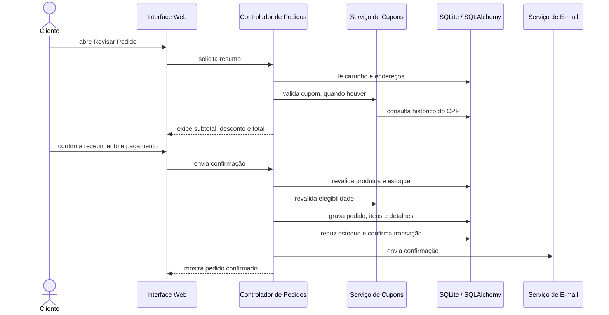
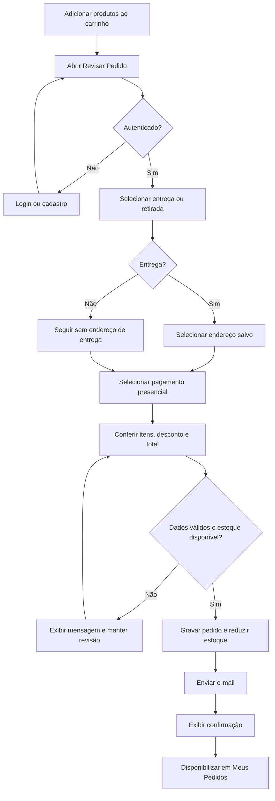
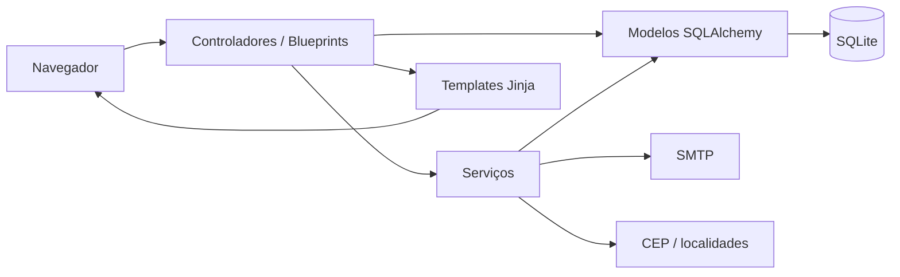

# 3 - UML e Arquitetura Revisadas

## 3.1 Perspectivas da modelagem

A modelagem foi atualizada para representar a solução final em quatro perspectivas:

1. funcional, por atores e casos de uso;
3. estrutural, por classes e relacionamentos persistidos;
3. comportamental, pelos fluxos de autenticação e compra;
4. arquitetural, pela separação de modelos, controladores, serviços, templates e recursos estáticos.

## 3.2 Casos de uso principais

## 3.3 Classes do domínio

| Classe | Responsabilidade |
| --- | --- |
| Cliente | Conta, autenticação e vínculo com pedidos e dados pessoais |
| Categoria | Organização do catálogo |
| Produto | Item comercializado, preço, estoque e imagem |
| Endereco | Endereço salvo do cliente |
| Favorito | Associação entre cliente e produto favorito |
| Pedido | Compra confirmada e valor final |
| ItemPedido | Produto, quantidade e valores históricos do pedido |
| DetalhePedido | Recebimento, pagamento, frete, cupom, desconto e endereço usado |
| AlteracaoConta | Solicitação temporária de alteração ou exclusão |
| SegurancaConta | Referência de troca periódica de senha |
| DispositivoConfiavel | Navegador aprovado para a conta |

## 3.4 Sequência da finalização do pedido

## 3.5 Atividade principal de compra

## 3.6 Arquitetura

| Camada | Local no projeto | Responsabilidade |
| --- | --- | --- |
| Model | `aplicacao/modelos/` | entidades e relacionamentos persistidos |
| Controller | `aplicacao/controladores/` | rotas, validações HTTP e coordenação dos fluxos |
| View | `aplicacao/templates/` | páginas Jinja apresentadas ao usuário |
| Service | `aplicacao/servicos/` | e-mail, tokens, cupom e operações compartilhadas |
| Static | `aplicacao/static/` | CSS, JavaScript, imagens, manifesto e Service Worker |
