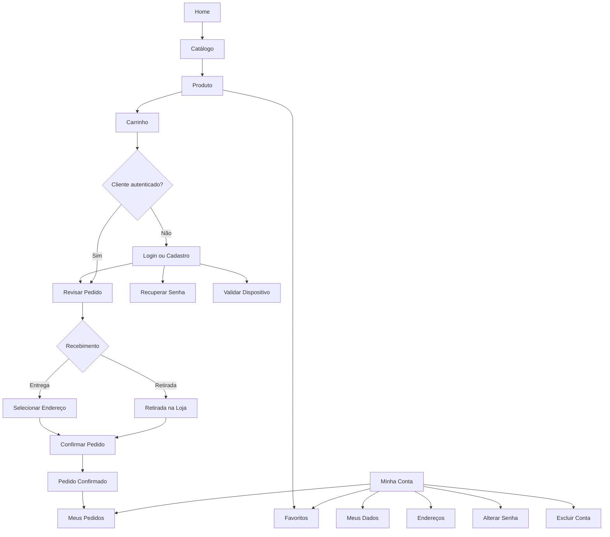

# 4 - IHC e Experiência do Usuário Revisadas

## 4.1 Objetivo da revisão

A interface foi revisada para tornar as ações principais visíveis, reduzir informação desnecessária, manter feedback consistente e funcionar de forma previsível em desktop e dispositivos móveis. Foram aplicados os princípios apresentados no material da PIT II: clareza, consistência, simplicidade, controle pelo usuário, relação direta entre ação e resultado, possibilidade de recuperação, feedback e organização visual.

## 4.2 Telas atuais

| Tela/área | Finalidade |
| --- | --- |
| Home | Apresentação da loja, destaques, benefícios e acesso ao catálogo. |
| Catálogo | Busca, filtros, ordenação e navegação entre produtos ativos. |
| Produto | Detalhes, preço, disponibilidade, quantidade, carrinho e favorito. |
| Carrinho | Itens, quantidades, subtotais, cupom e total. |
| Login e Cadastro | Autenticação, criação de conta e recuperação de senha. |
| Minha Conta | Dados pessoais, alteração de senha, segurança e exclusão da conta. |
| Endereços | Cadastro, edição, exclusão e definição de endereço principal. |
| Favoritos | Produtos marcados pelo cliente. |
| Revisar Pedido | Recebimento, endereço, pagamento e resumo final. |
| Meus Pedidos | Histórico, situação e itens de cada pedido. |
| Institucional | Sobre, entrega, privacidade, cookies, termos, segurança e ajuda. |
| Offline | Feedback quando a aplicação não consegue acessar o servidor. |

## 4.3 Critérios aplicados

### Consistência

- cabeçalho e rodapé compartilhados;
- botões e mensagens com padrão comum;
- cards de produto reutilizados;
- formulários com labels visíveis ou flutuantes;
- títulos, termos e capitalização revisados.

### Feedback e prevenção de erros

- validação de formulários, estoque e quantidades;
- opções de pagamento on-line visíveis, mas desabilitadas;
- seleção de UF antes do município;
- preservação do carrinho durante autenticação;
- etapa de revisão antes da confirmação do pedido;
- mensagens integradas ao próprio site.

### Recuperação

- falhas de validação mantêm o usuário no contexto adequado;
- a página offline permite nova tentativa;
- uma falha de SMTP depois da persistência não apaga o pedido já registrado.

## 4.4 Mensagens, Feedback e Tratamento de Erros

A interface utiliza mensagens integradas ao próprio site para orientar o usuário durante ações, validações e situações de erro. O objetivo é informar o que ocorreu, preservar o contexto da operação e indicar uma ação de recuperação quando aplicável.

| Situação | Feedback apresentado | Recuperação esperada |
| --- | --- | --- |
| Campo obrigatório ou inválido | mensagem associada ao formulário | corrigir o dado e reenviar |
| Credenciais inválidas | mensagem de autenticação sem exposição de detalhes internos | revisar e-mail e senha ou recuperar a senha |
| Quantidade superior ao estoque | aviso de indisponibilidade ou limite | ajustar a quantidade |
| Cupom não elegível | informação de que o benefício não pode ser aplicado | continuar sem o desconto ou revisar os critérios |
| Ausência de endereço para entrega | orientação para cadastrar ou selecionar endereço | acessar o gerenciamento de endereços |
| Ação sensível na conta | confirmação adicional e, quando previsto, validação por e-mail | concluir ou cancelar a operação |
| Novo dispositivo | solicitação de validação do dispositivo | confirmar pelo fluxo de segurança |
| Falha de conexão | página offline com ação de nova tentativa | restabelecer a conexão e tentar novamente |
| Falha de transporte de e-mail após pedido | o pedido permanece registrado | consultar o pedido em Meus Pedidos |

As mensagens foram revisadas para manter terminologia, capitalização e apresentação consistentes entre as páginas.

## 4.5 Melhorias incorporadas após a revisão

| Situação identificada | Atualização realizada |
| --- | --- |
| Tela offline densa | Simplificação e ação clara de nova tentativa |
| Baixa visibilidade no Modo Escuro | Revisão de contraste e superfícies |
| Excesso visual e quebras em mobile | Reorganização de menu, grids, formulários e tamanhos |
| Pouco conteúdo institucional | Ampliação de Sobre, rodapé, privacidade, cookies e segurança |
| Pouca autonomia na conta | Edição de dados, endereços, favoritos e exclusão da conta |
| Compra direta demais | Revisar Pedido com endereço, recebimento, pagamento e resumo |
| FAQ e cards desproporcionais | FAQ reestruturada, filtros e compactação de componentes |
| Textos inconsistentes | Revisão textual e padronização de termos e títulos |

## 4.6 Mapa Conceitual da Navegação

## 4.7 Responsividade, tema e PWA

A interface utiliza Bootstrap e CSS próprio, reorganizando menu, grids, formulários, cards e botões conforme o espaço disponível. A solução oferece tema claro e escuro, foco visível, navegação por teclado, atributos ARIA, PWA com manifesto e Service Worker e uma página dedicada ao modo offline.

## 4.8 Evolução do Protótipo e da Interface

Os arquivos-fonte dos protótipos originalmente produzidos na PIT I não estão disponíveis no repositório atual. Por esse motivo, eles não foram recriados artificialmente.

A revisão e o incremento da interface são demonstrados por meio da evolução real da aplicação implementada. Foram preservados estados anteriores de cinco áreas da solução, permitindo comparar a situação observada durante o desenvolvimento com a versão final corrigida.

| Área | Situação anterior | Evolução realizada |
| --- | --- | --- |
| Home Mobile | adaptação limitada em telas menores | reorganização dos controles, conteúdo e responsividade |
| Catálogo | cards grandes e ausência dos filtros atuais | filtros, ordenação e compactação dos cards |
| Produto | excesso visual e dimensões maiores | reorganização da imagem, informações e ações |
| FAQ | problemas de layout e contraste | revisão para desktop, mobile e Modo Escuro |
| Offline | excesso de informações e retomada pouco clara | simplificação e ação clara de nova tentativa |

Os comparativos reais estão documentados em:

[`EVIDENCIAS_ANTES_DEPOIS.md`](../03-TESTES-E-QUALIDADE/EVIDENCIAS_ANTES_DEPOIS.md)

Dessa forma, o incremento do protótipo é representado pela evolução efetivamente realizada na interface, utilizando somente evidências preservadas durante o desenvolvimento.
