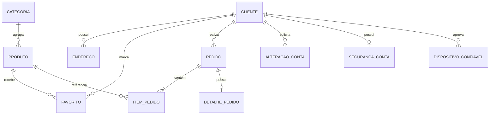

# 5 - Projeto de Banco de Dados Revisado

## 5.1 Tecnologia adotada

A versão final utiliza **SQLite** como SGBD e **SQLAlchemy/Flask-SQLAlchemy** como camada de mapeamento objeto-relacional. O planejamento anterior usava MySQL como referência de projeto físico; a revisão substitui essa decisão pelo banco efetivamente utilizado.

O banco local padrão é criado em `instance/doce_pedido.db` e não é versionado. O esquema inicial é criado com `banco.create_all()`. O projeto não utiliza uma ferramenta geral de migrations; existe uma rotina aditiva de compatibilidade para bases SQLite locais antigas.

## 5.2 Projeto conceitual

Entidades persistentes:

- Cliente
- Categoria
- Produto
- Endereço
- Favorito
- Pedido
- Item do Pedido
- Detalhe do Pedido
- Alteração da Conta
- Segurança da Conta
- Dispositivo Confiável

O cupom `BEMVINDO` é uma regra de negócio, não uma entidade. Seu código e o valor do desconto são preservados em `detalhe_pedido` quando utilizados.

## 5.3 Projeto lógico

O relacionamento muitos-para-muitos entre cliente e produto, usado em favoritos, é resolvido pela tabela `favorito`. O relacionamento entre pedido e produto é resolvido por `item_pedido`, que também registra quantidade, valor unitário e subtotal.

Os valores do pedido são preservados historicamente. Alterações posteriores de preço ou endereço não modificam pedidos já confirmados, porque `item_pedido.valor_unitario`, `item_pedido.subtotal` e `detalhe_pedido.endereco_entrega` guardam os dados utilizados naquele fechamento.

## 5.4 Projeto físico

- **SGBD:** SQLite
- **ORM:** SQLAlchemy / Flask-SQLAlchemy
- **Chaves primárias:** inteiros, salvo a chave compartilhada de `seguranca_conta`
- **Chaves estrangeiras:** utilizadas entre entidades relacionadas
- **Valores monetários:** `Numeric(10, 2)`
- **Datas:** `DateTime`
- **Textos longos:** `Text`
- **Criação inicial:** `banco.create_all()`

## 5.5 Dicionário de dados

### `cliente`

| Campo | Tipo | Nulo | Regra / finalidade |
| --- | --- | --- | --- |
| id | Integer | Não | Chave primária |
| nome | String(120) | Não | Nome do cliente |
| email | String(255) | Não | Único e indexado |
| cpf | String(11) | Compat. | Único; obrigatório em novos cadastros e imutável |
| senha_hash | String(255) | Não | Hash da senha |
| telefone | String(20) | Sim | Celular normalizado |
| ativo | Boolean | Não | Permite autenticação |
| data_cadastro | DateTime | Não | Data de criação |

### `categoria`

| Campo | Tipo | Nulo | Regra / finalidade |
| --- | --- | --- | --- |
| id | Integer | Não | Chave primária |
| nome | String(80) | Não | Único |
| descricao | Text | Sim | Descrição |
| ativo | Boolean | Não | Estado da categoria |

### `produto`

| Campo | Tipo | Nulo | Regra / finalidade |
| --- | --- | --- | --- |
| id | Integer | Não | Chave primária |
| categoria_id | Integer | Não | FK categoria |
| nome | String(120) | Não | Nome exibido |
| descricao | Text | Sim | Descrição |
| preco | Numeric(10,2) | Não | Preço unitário |
| estoque | Integer | Não | Quantidade disponível |
| ativo | Boolean | Não | Disponibilidade |
| imagem | String(255) | Sim | Caminho da imagem |

### `endereco`

| Campo | Tipo | Nulo | Regra / finalidade |
| --- | --- | --- | --- |
| id | Integer | Não | Chave primária |
| cliente_id | Integer | Não | FK cliente |
| nome | String(60) | Não | Identificador do endereço |
| cep | String(8) | Não | CEP |
| logradouro | String(160) | Não | Logradouro |
| numero | String(20) | Não | Número |
| complemento | String(100) | Sim | Complemento |
| bairro | String(100) | Não | Bairro |
| cidade | String(100) | Não | Município |
| uf | String(2) | Não | UF |
| referencia | String(180) | Sim | Ponto de referência |
| principal | Boolean | Não | Endereço preferencial |
| criado_em | DateTime | Não | Data de criação |

### `favorito`

| Campo | Tipo | Nulo | Regra / finalidade |
| --- | --- | --- | --- |
| id | Integer | Não | Chave primária |
| cliente_id | Integer | Não | FK cliente |
| produto_id | Integer | Não | FK produto |
| criado_em | DateTime | Não | Data de marcação |

### `pedido`

| Campo | Tipo | Nulo | Regra / finalidade |
| --- | --- | --- | --- |
| id | Integer | Não | Chave primária e número do pedido |
| cliente_id | Integer | Não | FK cliente |
| data_pedido | DateTime | Não | Data de confirmação |
| status | String(30) | Não | Situação do pedido |
| valor_total | Numeric(10,2) | Não | Total final |

### `item_pedido`

| Campo | Tipo | Nulo | Regra / finalidade |
| --- | --- | --- | --- |
| id | Integer | Não | Chave primária |
| pedido_id | Integer | Não | FK pedido |
| produto_id | Integer | Não | FK produto |
| quantidade | Integer | Não | Quantidade comprada |
| valor_unitario | Numeric(10,2) | Não | Preço histórico |
| subtotal | Numeric(10,2) | Não | Quantidade x valor |

### `detalhe_pedido`

| Campo | Tipo | Nulo | Regra / finalidade |
| --- | --- | --- | --- |
| id | Integer | Não | Chave primária |
| pedido_id | Integer | Não | FK única para pedido |
| tipo_entrega | String(30) | Não | Entrega ou Retirada na Loja |
| forma_pagamento | String(30) | Não | Presencial |
| valor_frete | Numeric(10,2) | Não | Zero no fluxo atual |
| cupom_codigo | String(30) | Sim | Cupom aplicado |
| valor_desconto | Numeric(10,2) | Não | Valor descontado |
| endereco_entrega | Text | Sim | Cópia do endereço usado |

### `alteracao_conta`

| Campo | Tipo | Nulo | Regra / finalidade |
| --- | --- | --- | --- |
| id | Integer | Não | Chave primária |
| cliente_id | Integer | Não | FK cliente |
| tipo | String(20) | Não | dados, senha ou exclusao |
| token_hash | String(64) | Não | Hash do token |
| senha_fingerprint | String(64) | Não | Vínculo com estado da senha |
| dados_json | Text | Sim | Dados pendentes |
| senha_hash_nova | String(255) | Sim | Nova senha pendente |
| criado_em | DateTime | Não | Criação |
| expira_em | DateTime | Não | Validade |
| concluida_em | DateTime | Sim | Confirmação |

### `seguranca_conta`

| Campo | Tipo | Nulo | Regra / finalidade |
| --- | --- | --- | --- |
| cliente_id | Integer | Não | PK e FK cliente |
| senha_alterada_em | DateTime | Não | Referência para troca periódica |
| senha_fingerprint | String(64) | Sim | Identifica alteração do hash |

### `dispositivo_confiavel`

| Campo | Tipo | Nulo | Regra / finalidade |
| --- | --- | --- | --- |
| id | Integer | Não | Chave primária |
| cliente_id | Integer | Não | FK cliente |
| token_hash | String(64) | Não | Hash único do navegador |
| user_agent | String(255) | Sim | Informação auxiliar |
| criado_em | DateTime | Não | Data de aprovação |
| expira_em | DateTime | Não | Validade |

## 5.6 Integridade complementar

Além das restrições do banco, os controladores e serviços validam CPF, e-mail, celular, CEP, UF, propriedade de endereços e pedidos, estoque, quantidades, cupom e regras de segurança antes de persistir alterações.

O SQLite é adequado ao escopo acadêmico e ao ambiente atual. Uma publicação de maior escala deveria definir política de backup, persistência, concorrência e evolução de esquema antes de mudanças estruturais.
